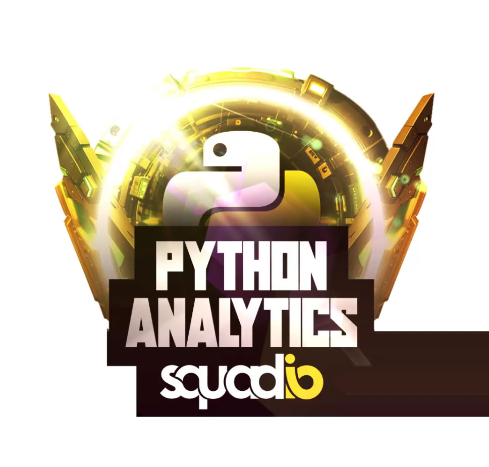

# Bootcamp Data Analyst DIO

No Bootcamp Data Analyt DIO patrocinado pela Squadio realizado em abril de 2024 foram abordados os seguintes assuntos:

- GIT
- Banco de dados relacionais
- Banco de dados não relacionais
- Python
- Power Bi
- Inteligência Artificial

Neste repositório estão disponíveis os materiais de estudos do curso.
